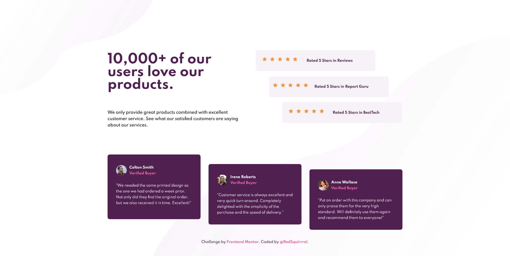
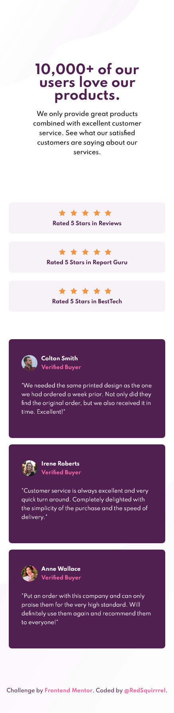

# Frontend Mentor - Social proof section solution

This is a solution to the [Social proof section challenge on Frontend Mentor](https://www.frontendmentor.io/challenges/social-proof-section-6e0qTv_bA). Frontend Mentor challenges help you improve your coding skills by building realistic projects.

## Table of contents

- [Overview](#overview)
  - [The challenge](#the-challenge)
  - [Screenshot](#screenshot)
  - [Links](#links)
- [My process](#my-process)
  - [Built with](#built-with)
  - [What I learned](#what-i-learned)
  - [Continued development](#continued-development)
  - [Useful resources](#useful-resources)
- [Author](#author)

## Overview

### The challenge

Users should be able to:

- View the optimal layout for the section depending on their device's screen size

### Screenshot

Desktop view

Mobile view

### Links

- Solution URL: [My solution URL](https://github.com/RedSquirrrel/social-proof#the-challenge)
- Live Site URL: [live site URL still in progress](https://redsquirrrel.github.io/social-proof/)

## My process

### Built with

- Mobile-first workflow
- Semantic HTML5 markup
- CSS custom properties
- Flexbox
- Grid

### What I learned

- keep my code clean and organizaed
- rethink the project

### Continued development

- CSS Grid

### Useful resources

- [An article about CSS Grid](https://css-tricks.com/snippets/css/complete-guide-grid/)

## Author

- Website - [Anette](https://redsquirrrel.github.io/social-proof/)
- Frontend Mentor - [@RedSquirrrel](https://www.frontendmentor.io/profile/RedSquirrrel)
